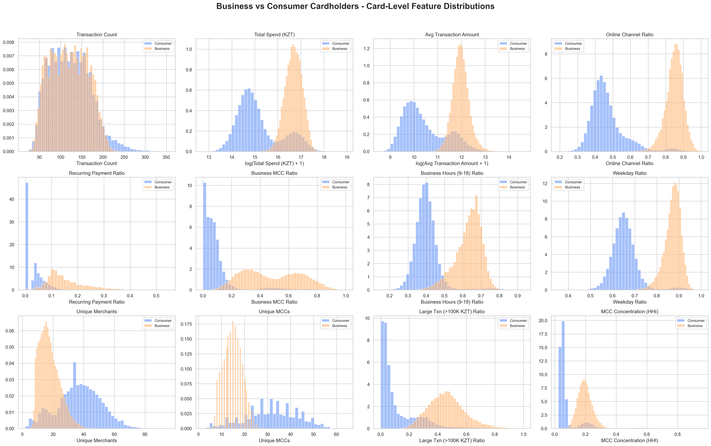

# EDA Findings

This document summarizes the exploratory analysis from:

- `EDA/00_data_overview.ipynb`
- `EDA/01_data_quality.ipynb`
- `EDA/02_transaction_behavior.ipynb`
- `EDA/03_card_level_behavior.ipynb`

## 00. Data Overview

The dataset contains two transaction tables and one merchant reference table:

| Table | Rows | Main entity count |
| --- | ---: | ---: |
| Business transactions | 2,997,593 | 25,000 cards |
| Consumer transactions | 9,832,487 | 80,000 cards |
| Merchant reference | 2,165 | 2,165 merchants |

Both transaction tables cover the same six-month period:

- Business: `2025-10-01 00:00:00` to `2026-03-31 23:59:53`
- Consumer: `2025-10-01 00:00:00` to `2026-03-31 23:59:49`

The competition data includes MCC codes but not full MCC names. For interpretability, an external Mastercard Quick Reference Booklet was parsed into `data/clean/mcc.csv`. The cleaned MCC reference now contains 1,303 MCC rows and covers all MCC codes used in the transaction data.

## 01. Data Quality

Basic quality checks passed:

- Duplicate rows: `0` in business, consumer, and merchant tables.
- Missing values: no missing values in the original transaction and merchant tables.
- Card overlap between business and consumer: `0` cards.
- Merchant join coverage: 100% for both business and consumer transactions.
- Invalid timestamps: `0`.
- Negative or zero transaction amounts: `0`.
- MCC name coverage after enrichment: 100%.

### MER_000000 MCC Conflict

The main data quality anomaly is `MER_000000`.

`MER_000000` is listed as Google Ads in the merchant reference with MCC `7311`, but transaction data contains a second MCC:

| Segment | Conflict rows | Conflict share |
| --- | ---: | ---: |
| Business | 17,701 | 0.5905% |
| Consumer | 43,150 | 0.4389% |

All detected MCC conflicts are:

```text
merchant_id = MER_000000
transaction MCC = 7012
merchant reference MCC = 7311
```

Interpretation:

- MCC `7311` is Advertising Services and fits Google Ads.
- MCC `7012` does not fit Google Ads and behaves like a placeholder or merchant-assignment artifact.
- For EDA plots, `MER_000000 + MCC 7012` should not be counted as ordinary Google Ads behavior.
- The raw fields remain unchanged; EDA uses a cleaned display/key treatment where needed to avoid misleading merchant-level conclusions.

## 02. Transaction-Level Behavior

Transaction-level EDA compares individual business and consumer transactions. These findings are descriptive; final modeling should use card-level aggregates.

### Amounts

Business transactions are much larger than consumer transactions:

| Metric | Business | Consumer |
| --- | ---: | ---: |
| Mean amount | 156,535 KZT | 54,045 KZT |
| Median amount | 77,224 KZT | 11,892 KZT |
| 75th percentile | 196,081 KZT | 39,665 KZT |
| 99th percentile | 1,090,845 KZT | 699,869 KZT |

Large transactions are also more common in business:

| Threshold | Business share | Consumer share |
| ---: | ---: | ---: |
| >= 10,000 KZT | 84.70% | 54.01% |
| >= 50,000 KZT | 60.22% | 21.22% |
| >= 100,000 KZT | 43.70% | 11.77% |
| >= 500,000 KZT | 6.40% | 1.70% |

Feature implication: amount aggregates and large-transaction ratios are important candidate features.

### Channel And Payment Type

Business transactions are more online-heavy and more recurring:

| Metric | Business | Consumer |
| --- | ---: | ---: |
| Online share | 84.66% | 46.51% |
| Recurring share | 13.34% | 2.72% |
| Tokenized share | 60.00% | 38.63% |
| Recurring-capable merchant share | 32.13% | 6.87% |

Feature implication: `online_ratio`, `recurring_ratio`, `tokenized_ratio`, and `recurring_capable_ratio` should be useful card-level features.

### Timing

Business transactions are more concentrated during weekday business hours, while consumer transactions are more weekend-heavy:

| Time bucket | Business | Consumer |
| --- | ---: | ---: |
| Weekday business hours | 64.74% | 39.97% |
| Weekend | 12.45% | 34.80% |

Feature implication: `weekday_business_hours_ratio`, `weekday_non_business_hours_ratio`, and `weekend_ratio`.

### Merchant And MCC Composition

Business transaction categories are strongly concentrated in commercial and operational categories. The top business-overrepresented MCC names include:

| MCC category | Business share | Consumer share | Business / consumer ratio |
| --- | ---: | ---: | ---: |
| Computer Programming, Data Processing, and Integrated Systems Design Services | 8.00% | 0.47% | 17.0x |
| Advertising Services | 9.06% | 2.60% | 3.5x |
| Direct Marketing: Continuity/Subscription Merchants | 6.86% | 0.48% | 14.3x |
| Computer Network/Information Services | 6.33% | 0.28% | 22.2x |
| Business Services: not elsewhere classified | 3.64% | 0.06% | 60.8x |
| Computers, Computer Peripheral Equipment, Software | 3.14% | 0.06% | 55.4x |
| Consulting, Management, and Public Relations Services | 3.13% | 0.13% | 24.7x |
| Motor Freight Carriers, Trucking | 2.78% | 0.13% | 20.8x |
| Commercial Equipment: not elsewhere classified | 2.55% | 0.13% | 19.1x |
| Courier Services | 2.62% | 0.21% | 12.6x |

Feature implication: commercial MCC groups should be converted into card-level category ratios.

## 03. Card-Level Behavior

Card-level EDA checks whether the transaction-level patterns remain visible when each `card_number` is treated as one behavioral profile.

### Activity Frequency

Transaction count per card is similar between segments:

| Metric | Business | Consumer |
| --- | ---: | ---: |
| Median transactions/card | 119 | 120 |
| Mean transactions/card | 119.90 | 122.91 |

Interpretation: frequency alone is not the main separator.

### Spend Level

Business cards spend much more over the six-month window:

| Metric | Business | Consumer |
| --- | ---: | ---: |
| Median total spend/card | 17,714,892 KZT | 2,976,294 KZT |
| Mean total spend/card | 18,769,162 KZT | 6,642,512 KZT |

Business cards also have much larger typical transaction sizes at the card level:

| Metric | Business | Consumer |
| --- | ---: | ---: |
| Median of card average amount | 155,610 KZT | 26,775 KZT |
| Median of card median amount | 84,559 KZT | 9,674 KZT |
| Amount coefficient of variation | 1.32 | 1.78 |

Interpretation: business cards have larger typical transaction sizes, while consumer cards have more variable transaction amounts inside the same card.

Feature implication: `total_amount`, `avg_amount`, `median_amount`, `amount_cv`, and large-ticket ratios.

### Channel, Recurring, And Digital Behavior

Card-level medians:

| Metric | Business | Consumer |
| --- | ---: | ---: |
| Online ratio | 85.25% | 44.72% |
| Recurring ratio | 13.43% | 0.00% |
| Tokenized ratio | 59.49% | 38.55% |
| Recurring-capable merchant ratio | 29.41% | 3.21% |

Interpretation: business cards show stronger online, recurring, tokenized, and subscription-capable merchant behavior.

### Timing Behavior

Card-level medians:

| Metric | Business | Consumer |
| --- | ---: | ---: |
| Weekday business-hours ratio | 64.29% | 39.47% |
| Weekend ratio | 12.41% | 35.02% |
| Evening ratio | 10.71% | 31.67% |
| Night ratio | 15.70% | 9.52% |
| Monthly spend growth | 1.04% | -10.09% |
| Active months | 6 | 6 |

Interpretation: business cards are more work-hours oriented; consumer cards are more weekend-heavy and evening-heavy. `evening_ratio` is a useful anti-business signal. `night_ratio` and `monthly_spend_growth` are weaker and should be validated during modeling.

`active_months` is not useful in this form because the median is 6 months for both segments.

### Merchant And MCC Diversity

Consumer cards are broader across merchants and MCCs:

| Metric | Business | Consumer |
| --- | ---: | ---: |
| Median unique merchants/card | 16 | 37 |
| Median unique MCC/card | 15 | 32 |

Interpretation: business cards are more concentrated in a narrower set of operational categories, while consumer cards cover broader everyday spending.

### Country And Merchant Country Behavior

Two different geography fields are used:

- `country`: country where the transaction was processed.
- `merchant_country`: country where the merchant is registered or billed.

Card-level medians:

| Metric | Business | Consumer |
| --- | ---: | ---: |
| Foreign transaction ratio, `country != Kazakhstan` | 29.22% | 21.52% |
| Foreign merchant ratio, `merchant_country != Kazakhstan` | 32.31% | 2.42% |

Interpretation: foreign transaction ratio is slightly higher for business cards, but the difference is not very clean. Foreign merchant ratio is much stronger because business cards often pay foreign-registered digital providers such as ads, cloud, hosting, SaaS, and other online services.

Feature implication: `foreign_merchant_ratio` should be a strong candidate feature. `foreign_transaction_ratio` can be tested, but it looks weaker.

### B2B MCC Exposure

Business cards have higher exposure to B2B-like MCC groups such as advertising, software/cloud, business services, logistics, telecom, professional services, and office supplies.

Feature implication: final model features should include interpretable card-level B2B MCC ratios rather than relying only on raw MCC codes.

## Modeling Implications

The EDA supports a card-level modeling approach:

- one row per `card_number`;
- business cards as known positive examples of commercial behavior;
- consumer cards treated carefully because they may contain hidden business-like users;
- transaction-level observations converted into card-level features.

Candidate feature families:

- Spend size: `total_amount`, `avg_amount`, `median_amount`, `max_amount`, `amount_cv`, large-transaction ratios.
- Channel/payment: `online_ratio`, `pos_ratio`, `is_recurring_ratio`, `tokenized_ratio`, `recurring_capable_ratio`.
- Timing: `weekday_business_hours_ratio`, `weekday_non_business_hours_ratio`, `weekend_ratio`, `evening_ratio`, `night_ratio`, `monthly_spend_growth`.
- Geography: `foreign_transaction_ratio`, `foreign_merchant_ratio`.
- Diversity/concentration: `unique_merchants`, `unique_mcc`, `merchant_entropy`, `mcc_entropy`.
- MCC composition: advertising, software/cloud, business services, office supplies, telecom, logistics, professional services, and composite B2B ratios.

Features to treat carefully:

- `active_months`: weak in current data because most cards are active during all six months.
- raw `merchant_id` and `merchant_name`: high-cardinality identifiers can overfit and can be affected by artifacts like `MER_000000`.
- `card_number`: identifier only, not a modeling feature.



